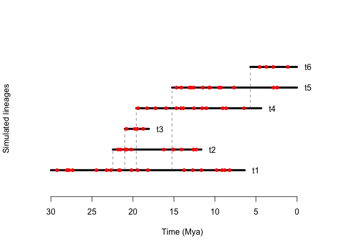

<!-- README.md is generated from README.Rmd. Please edit that file -->

# paleobuddy

<!-- badges: start -->

[](https://github.com/brpetrucci/paleobuddy/actions/workflows/R-CMD-check.yaml)
[](https://cran.r-project.org/package=paleobuddy)
<!-- badges: end -->

`paleobuddy` is an R package to simulate species diversification, fossil
records, and phylogenetic trees. While the literature on species
birth-death simulators is extensive, including important software like
[paleotree](https://github.com/dwbapst/paleotree) and
[APE](https://github.com/cran/ape), we concluded there were interesting
gaps to be filled regarding possible diversification scenarios.
Differently from most simulators in the field, we strove for flexibility
over focus, implementing a large array of regimens for users to
experiment with and combine, and structuring the package on a general
framework to allow for straightforward expansion of available scenarios.
In this way, `paleobuddy` can be used as a complement to other
simulators or, in the case of scenarios implemented only here, can allow
for robust and easy simulations for novel scenarios.

## Installation

You can install the released version of paleobuddy from
[CRAN](https://CRAN.R-project.org) with:

``` r
install.packages("paleobuddy")
```

And the development version from [GitHub](https://github.com/) with:

``` r
library(devtools)
devtools::install_github("brpetrucci/paleobuddy")
```

## Example

We run a simple birth-death simulation as follows

``` r
set.seed(1)

n0 <- 1 # initial number of species
lambda <- 0.1 # speciation rate
mu <- 0.05 # extinction rate
tMax <- 30 # maximum simulation time

# run simulation
sim <- bd.sim(n0, lambda, mu, tMax)
```

We can then generate fossil records, and visualize the results

``` r
set.seed(1)

rho <- 1 # sampling rate
bins <- seq(tMax, 0, -1) # something to simulate geologic intervals

# get a data frame with fossil occurrence times
fossils <- sample.clade(sim = sim, rho = rho, tMax = tMax, bins = bins)

# visualize simulation and fossil occurrences
draw.sim(sim, fossils)
```



And generate phylogenies as well

``` r
phy <- make.phylo(sim) # make a phylogenetic tree with the simulated group
ape::plot.phylo(phy, root.edge = TRUE) # plot it with a stem (requires APE)
ape::axisPhylo() # add axis
```


## Important functions

`bd.sim` is the birth-death simulation function, allowing for multiple
arguments to build a large number of possible scenarios. One can supply
constant or time-dependent speciation rate `lambda` and extinction rate
`mu`. On top of the base rates, we allow for a `shape` parameter for
each, if one chooses to interpret `lambda` and `mu` as scales of a
Weibull distribution for age-dependent diversification. We take the
novel step allowing for time-dependent scale and shape as well. One can
also supply an `env` parameter to make rates dependent on a time-series,
such as temperature. These can all be combined as the user wishes,
creating a myriad of possible scenarios.

`sample.clade` generates fossil records, returning an organized data
frame with occurrence times - or occurrence time ranges, provided the
user supplies the respective interval vector. It allows for a sampling
rate `rho` that can be as flexible as `lambda` and `mu` above, with the
exception of a `shape` parameter, since we omitted that option given the
absence of the use of Weibull distributions to model age-dependent
fossil sampling in the literature. Instead, we allow for the user to
supply a function they wish to use as age-dependent sampling, `adFun`,
such as the PERT distribution used in
[PyRate](https://github.com/dsilvestro/PyRate).

`make.phylo` closes the trio of most important functions of the package,
taking a `paleobuddy` simulation and returning a `phylo` object from the
APE package (see above).

`draw.sim` allows for easy visualization of birth-death simulation
objects, drawing species’ durations and kinship, besides allowing for
the addition of fossil occurrences as well.

Besides its main simulating and visualization functions, `paleobuddy`
also supplies the user with a few interesting statistical tools, such as
`rexp.var`, a generalization of the `rexp` function in base R that
allows for time-varying exponential rates and a `shape` parameter, in
which case it generalizes the `rweibull` function.

## Data

Given the possibility of functions in `paleobuddy` to use
environmentally-dependent rates, we have included with the package data
frames containing environmental data, namely temperature (`temp`) and
co2 (`co2`). These have been modified from data on RPANDA (RPANDA:
Morlon H. et al (2016) RPANDA: an R package for macroevolutionary
analyses on phylogenetic trees. Methods in Ecology and Evolution 7:
589-597). To see more about the origin of the data, see `?data`, where
`data` is the data frame’s name.

## Authors

`paleobuddy` was idealized by Bruno do Rosario Petrucci and Tiago
Bosisio Quental. The birth-death, statistical, and part of the sampling
functions were written by Bruno. The phylogeny and most of the sampling
functions were written by Matheus Januário.
